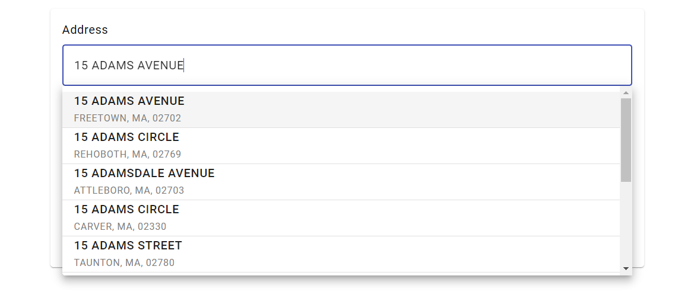
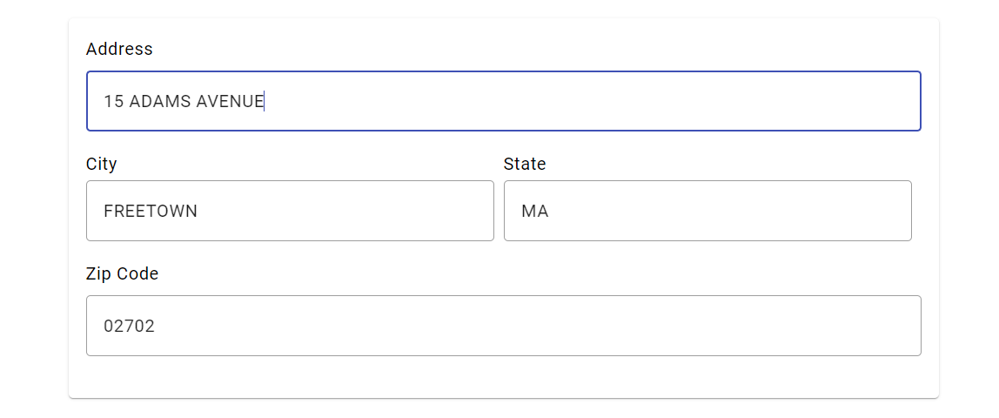

# Address Service

#### React Js Package 
Package Name - **address-service**

hoppysearch - React Js client for AddressService

## Installation

This project was generated with [React Js](https://react.dev/learn/start-a-new-react-project) version 18.2.0

### For [React.js](https://react.dev/learn/start-a-new-react-project)

### What You Get:

1. An React Js component for easy integration.
2. A user-friendly form-like interface.
3. Autocomplete functionality for the Address field.
4. Automatic filling of address fields upon user selection.
5. Modifiable fields for user data adjustments.ith a seamless experience to obtain addresses.

#### To preview the future appearance of the React component, visit the following website:[Address Service React Js Demo](http://address-service-react.s3-website.ap-south-1.amazonaws.com/)

## Getting Started

Please follow the [installation](#installation) instructions and execute the following React Js code:

#### Begin with the initial setup process:

1. Install the address-service package in your React project:

#### cmd

```javascript
npm i address-service
```

2. Import the component in your React project:

#### Javascript

```javascript
import Address from "address-service";
```

3. Use the component in your project:

```javascript
import Address from "address-service";
function App() {
  const handleOnChange = (data) => {
    console.log(data);
  };

  return (
    <div>
      <Address onChange={handleOnChange} />
    </div>
  );
}

export default App;
```

In this code, when the address changes, the **handleOnChange** function is called, and the new address is logged to the console.

**onChange** props is not mandatory.

#### If you need video help to install Address Service React Js package then watch this video:[Address Service React Js Demo](Add here your video Url)

#### You will get such a result:

1. You can type the address you want to search here.
   
2. Now click on the address you want.
   
